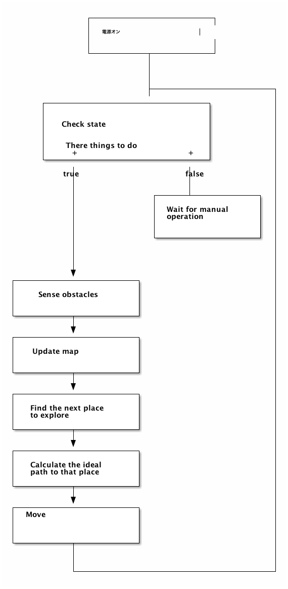

<nav id="table-of-contents">
<h2>Table of Contents</h2>

<ul>
<li><a href="#sec-1">1. 概要</a></li>
<li><a href="#sec-2">2. 目的</a>
<ul>
<li><a href="#sec-2-1">2.1. 自分の目的</a>
<ul>
<li><a href="#sec-2-1-1">2.1.1. Artificial Intelligence 人工知能</a></li>
<li><a href="#sec-2-1-2">2.1.2. Robotics</a></li>
<li><a href="#sec-2-1-3">2.1.3. mbed</a></li>
<li><a href="#sec-2-1-4">2.1.4. Domain Driven Development</a></li>
</ul>
</li>
<li><a href="#sec-2-2">2.2. 教育の機会を人に提供する</a>
<ul>
<li><a href="#sec-2-2-1">2.2.1. Artificial Intelligence 人工知能</a></li>
<li><a href="#sec-2-2-2">2.2.2. Robotics</a></li>
<li><a href="#sec-2-2-3">2.2.3. mbed</a></li>
<li><a href="#sec-2-2-4">2.2.4. Domain Driven Development</a></li>
</ul>
</li>
</ul>
</li>
<li><a href="#sec-3">3. サイズ</a></li>
<li><a href="#sec-4">4. 機能</a>
<ul>
<li><a href="#sec-4-1">4.1. 一連の動作</a>
<ul>
<li><a href="#sec-4-1-1">4.1.1. 動作条件</a></li>
<li><a href="#sec-4-1-2">4.1.2. 動作状態の確認</a></li>
<li><a href="#sec-4-1-3">4.1.3. マニュアルモード</a></li>
<li><a href="#sec-4-1-4">4.1.4. オートモード</a></li>
</ul>
</li>
<li><a href="#sec-4-2">4.2. 設定</a></li>
<li><a href="#sec-4-3">4.3. シミュレーション</a></li>
</ul>
</li>
</ul>

</nav>

# 概要

# 目的

## 自分の目的

### Artificial Intelligence 人工知能

-   人工知能を実際に実装して理解を深める

1.  Particle Filter

### Robotics

-   ロボットの設計から実装までをやりとげる

### mbed

-   今活発に発展を続けるマイコンを使用する

### Domain Driven Development

-   仕事にも活用できる知識を身につける

## 教育の機会を人に提供する

### Artificial Intelligence 人工知能

-   Bayes統計の理解
-   人工知能の理解

1.  Particle Filter

### Robotics

### mbed

-   mbed の発展に貢献

### Domain Driven Development

-   ソフトウエアのモジュール化
-   人工知能のモジュール化(?)

# サイズ

# 機能

## 一連の動作

### 動作条件

-   平らな場所
-   PC(Mac)でモニターアプリケーションをインストール
-   PC(Mac)に通信用XBeeモジュールをUSB接続

### 動作状態の確認

Robotに状態を視覚的に確認するLED

-   青（電源） 点灯時：電源オン、点滅時：バッテリー低下
-   緑（AI）  点灯時：AIモードオン、点滅時：マニュアル操作を待っている （消灯時：マニュアルモード）
-   黄（通信） 点灯時：コントロールと無線確率、ゆっくり点滅時：通信確立中、早く点滅：通信実行中
-   赤（エラー）点灯時：深刻なエラー発生によりシステム停止（要再設定or再起動）、点滅時：エラー発生（マニュアルで回復可能）

### マニュアルモード

1.  コマンドによる操作

    1.  モード変換
    
    2.  動作シークエンス
    
        前進（+値）・回転（+値）のコマンドの連続を入力。最後に「実行」を入力することで命令が実行される。
        -   前進
        -   回転
        -   実行

2.  GUI操作

    -   Qt

### オートモード

1.  人工知能

## 設定

## シミュレーション