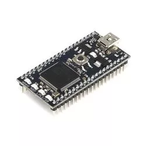
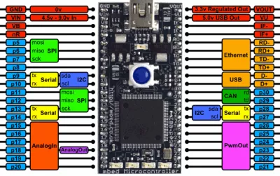
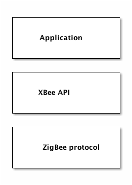
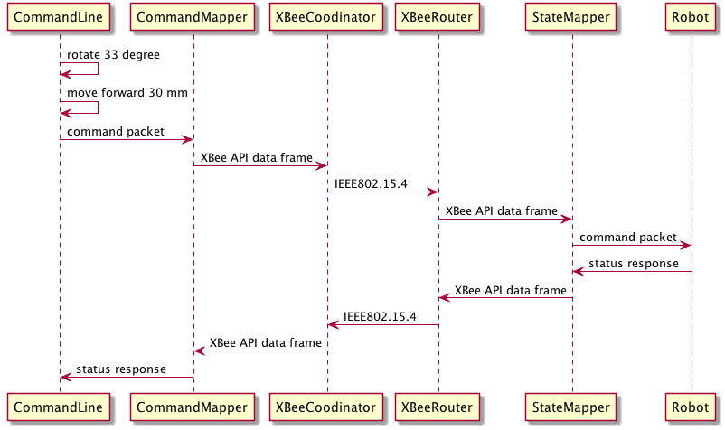
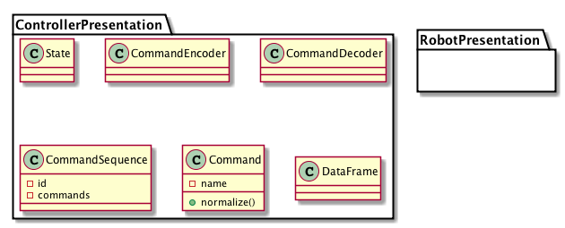
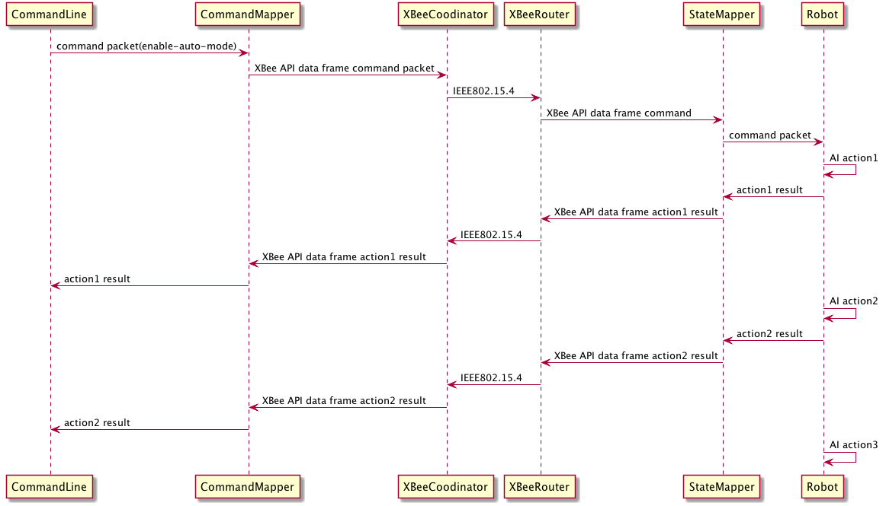

<nav id="table-of-contents">
<h2>Table of Contents</h2>

<ul>
<li><a href="#sec-1">1. 概要</a></li>
<li><a href="#sec-2">2. 動作とUI</a>
<ul>
<li><a href="#sec-2-1">2.1. ドメインロジック</a></li>
<li><a href="#sec-2-2">2.2. ロボット本体</a>
<ul>
<li><a href="#sec-2-2-1">2.2.1. TODO 基本動作</a></li>
<li><a href="#sec-2-2-2">2.2.2. 状態表示</a></li>
</ul>
</li>
</ul>
</li>
<li><a href="#sec-3">3. 人工知能について</a>
<ul>
<li><a href="#sec-3-1">3.1. Particle Filter</a></li>
<li><a href="#sec-3-2">3.2. Hidden Markov Model</a></li>
</ul>
</li>
<li><a href="#sec-4">4. ハードウエア</a>
<ul>
<li><a href="#sec-4-1">4.1. 物理的サイズ</a></li>
<li><a href="#sec-4-2">4.2. モジュール</a>
<ul>
<li><a href="#sec-4-2-1">4.2.1. マイコン</a></li>
<li><a href="#sec-4-2-2">4.2.2. バッテリー</a></li>
<li><a href="#sec-4-2-3">4.2.3. モーター</a></li>
<li><a href="#sec-4-2-4">4.2.4. モータードライバ</a></li>
<li><a href="#sec-4-2-5">4.2.5. 超音波距離センサ</a></li>
<li><a href="#sec-4-2-6">4.2.6. 無線モジュール</a></li>
</ul>
</li>
<li><a href="#sec-4-3">4.3. 回路</a>
<ul>
<li><a href="#sec-4-3-1">4.3.1. 電源回路</a></li>
<li><a href="#sec-4-3-2">4.3.2. モーター回路</a></li>
<li><a href="#sec-4-3-3">4.3.3. 無線回路</a></li>
</ul>
</li>
</ul>
</li>
<li><a href="#sec-5">5. ソフトウエア</a>
<ul>
<li><a href="#sec-5-1">5.1. レイヤー構造</a></li>
<li><a href="#sec-5-2">5.2. モニタリングとマニュアル操作コンポーネント</a></li>
<li><a href="#sec-5-3">5.3. ロボット状態シーケンス</a></li>
</ul>
</li>
<li><a href="#sec-6">6. モジュール別詳細</a>
<ul>
<li><a href="#sec-6-1">6.1. 役割別モジュール例</a>
<ul>
<li><a href="#sec-6-1-1">6.1.1. ワイヤレスシステム</a></li>
<li><a href="#sec-6-1-2">6.1.2. モニターとマニュアルコントロール</a></li>
</ul>
</li>
<li><a href="#sec-6-2">6.2. 実装</a>
<ul>
<li><a href="#sec-6-2-1">6.2.1. ロボット本体側：モジュール別</a></li>
<li><a href="#sec-6-2-2">6.2.2. PC側</a></li>
</ul>
</li>
<li><a href="#sec-6-3">6.3. 学習用拡張</a>
<ul>
<li><a href="#sec-6-3-1">6.3.1. シミュレータ</a></li>
<li><a href="#sec-6-3-2">6.3.2. 等価Pythonコード</a></li>
</ul>
</li>
</ul>
</li>
</ul>

</nav>

# 概要

-   本プログラムは、人工知能を持つロボットのプログラムである
-   ロボットは超音波センサーによって周囲の障害物を検知し、自ら周囲の地図を作成する
-   一旦地図のデータを手に入れたロボットは、現在位置を忘れた後、再度その地図のどこかに配置されると自ら地図上の位置を割り出す
-   ロボットの現在位置ならびに地図データは、無線により遠隔のパソコンにリアルタイムに送られる
-   複数の動作モードを持ち、マニュアルモードでは遠隔のパソコンから操作できる
-   ハードウエアのロボットの代わりに、ソフトウエアシミュレーターに置き換えることができ、サービス層以下のロジックはそのまま使用できる

# 動作とUI

## ドメインロジック

## ロボット本体

### TODO 基本動作

-   main関数に無限ループを置き、システムに異常が起こらない限り、その無限ループを抜けることはない

### 状態表示

チップLEDによる状態表示
-   高輝度青色チップＬＥＤ　２０１２サイズ　L-C170LBCT

<http://akizukidenshi.com/catalog/g/gI-00697/>

-   赤色チップＬＥＤ　OSHR1608　３５ｍｃｄ

<http://akizukidenshi.com/catalog/g/gI-03978/>

# 人工知能について

-   本プロジェクトは、人工知能（Artificial Intelligence: 以下、AI）に重点が置かれる

## Particle Filter

Particle Filter（[粒子フィルタ Wikipedia](http://ja.wikipedia.org/wiki/%E7%B2%92%E5%AD%90%E3%83%95%E3%82%A3%E3%83%AB%E3%82%BF)）

## Hidden Markov Model

[Hidden Markov Model](http://en.wikipedia.org/wiki/Hidden_Markov_model)

# ハードウエア

## 物理的サイズ

## モジュール

### マイコン

mbed [LPC1768](http://developer.mbed.org/platforms/mbed-LPC1768/) を使用

1.  TODO 特徴

2.  TODO スペック

    1.  pin配置
    
        

### バッテリー

### モーター

### モータードライバ

[TB6612FNG](http://jp.rs-online.com/web/p/motor-driver-ics/7703797/)
[データシート](http://docs-asia.electrocomponents.com/webdocs/1159/0900766b8115965f.pdf)

### 超音波距離センサ

[パララックス社超音波距離センサーモジュール](http://akizukidenshi.com/catalog/g/gM-05400/)

[データシート](http://akizukidenshi.com/download/ds/parallax/28015-PING-Sensor-Product-Guide-v2.0.pdf)

### 無線モジュール

[XBee series2](http://akizukidenshi.com/catalog/g/gM-06195/)

[XBee USBインターフェースボード](http://akizukidenshi.com/catalog/g/gK-06188/)

[XStick ZB](https://www.switch-science.com/catalog/1793/)

## 回路

### 電源回路

### モーター回路

### 無線回路

# ソフトウエア

## レイヤー構造

## モニタリングとマニュアル操作コンポーネント

## ロボット状態シーケンス

# モジュール別詳細

## 役割別モジュール例

### ワイヤレスシステム

1.  通信API: XBeeAPI - Communicationマッピング

    XBeeAPIをベースに、ロボット本体とコントロールPCとの間のAPIを定義する。
    XBeeAPIは、複数のXBeeモジュール間での通信APIだが、ここで定義するのは、ロボットとコントロールPCとの間でのデータAPIである。
    
    1.  通信レイヤー
    
        
    
    2.  TODO アプリケーションレイヤーAPI定義

2.  マニュアルモード

    1.  シーケンス
    
        1.  TODO シーケンスのレベル
        
            各種シーケンス図間の関係を説明する
        
        2.  プログラム単位のシーケンス
        
            1.  データ受信(ZigBee Receive Packet)
            
                
        
        3.  最大シーケンスレベル（？）
        
            -   CommandLine
            
            コマンドラインツール
            -   CommandMapper
            
            エンコーダーとデコーダーの2つで構成される。
            コマンドに入力したコマンドシークエンスをXBee APIフォームに変換し、その逆も。
            -   StateMapper
            
            エンコーダーとデコーダーの2つで構成される。
            XBee APIフォームデータをコマンドラインに表示できるように変換し、その逆も。
            
            -   XBeeCoodinator
            
            XBee API Coodinator と設定されたXBeeハードモジュール
            -   XBeeRouter
            
            XBee API Router と設定されたXBeeハードモジュール
            -   Robot
            
            ロボット本体（mbedがコントロール部）
            
            
    
    2.  アクティビティ
    
        
    
    3.  クラス構成
    
        
    
    4.  main psuedocode
    
            void showStatus()
            {
              printf('showing status');
            }
            
            void listCommands();
            {
            }
            
            void run(CommandSequence sequence)
            {
              encoder = CommandEncoder();
            
              encoded = encoder.encode(sequence);
            
            
            }
            
            int main()
            {
              string command = '';
            
              sequence = CommandSequence();
            
              while (command !== QUIT) {
            
                printf('enter a command');
            
                listCommands();
            
                showStatus();
            
                if (command === RUN) {
                  run(CommandSequence);
                } else if (/* command is valid */) {
                  sequence.addCommand(command);
                }
              }
            
              printf('exiting program');
            
              return 0;
            }

3.  オートーモード

    

### モニターとマニュアルコントロール

## 実装

### ロボット本体側：モジュール別

1.  XBee 無線制御部

    1.  XBee API mode
    
        -   0x10=パケット送信
        -   0x90=パケット受信
        -   0x8B=パケット送信の成否
    
    2.  無線通信フロー
    
        1.  障害物センサーデータ
        
            ロボット本体が回転し、同時にデータを収集しながら送信する。
            -   通常時
            -   エラー時
    
    3.  libxbee
    
        PC側（?）ライブラリ
        <https://github.com/thomasgubler/libxbee>
        
        大きすぎるため、これを参考にし自作を心がける。
    
    4.  XBee SmartLabXBeeAPI library
    
        mbed側のライブラリ。必要でないものも多いので、自作を心がける。
        
        1.  Class diagram

2.  Ping 超音波センサー部

3.  状態インジケータ部

4.  モータードライバ部

### PC側

## 学習用拡張

### シミュレータ

### 等価Pythonコード

-   同じAIロジックをPythonコードで実現する

